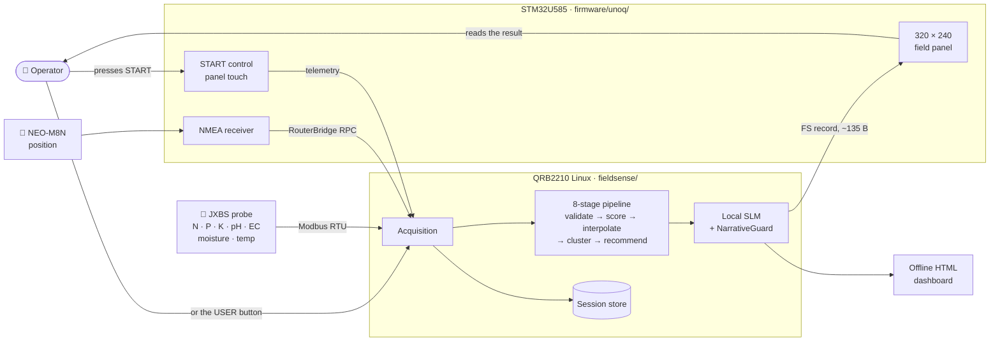
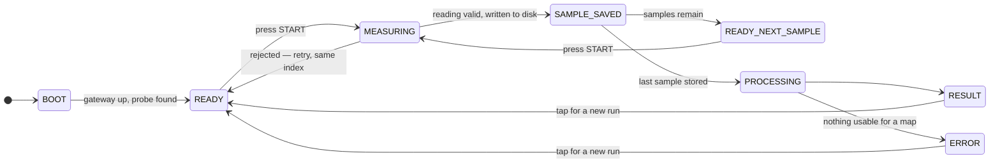

<div align="center">

# FieldSense

### A handheld instrument that reads soil at many points across a field, works out which patches need attention, and explains it in plain language — entirely offline, on a battery-powered board you can carry.


**Built by Neha Priya & Lovshik Vinnu** · Electronics & Communication Engineering

[](https://github.com/lovshikvinnu/FieldSense/actions/workflows/pytest.yml)


</div>

---

## What it does

A farmer fertilises at **one rate, everywhere** — so half the field is underfed
and half is over-fertilised. The over-fertilised half is the expensive half:
surplus nitrogen leaches into groundwater, salts build up, and next season needs
*more* input for the same yield.

Lab testing would catch it, but the economics don't work: 1–2 weeks for results,
and cost-per-sample means 2–3 samples for an entire field. Far too coarse to see
what matters.

**FieldSense walks the field with you.** Push the probe in, press the button,
walk to the next spot. After the last sample the device reconstructs the ground
between your readings, cuts it into patches you can actually act on, and puts
the answer on its own screen — before you leave the field.

|  | Lab testing | FieldSense |
| :--- | :--- | :--- |
| **Turnaround** | 1–2 weeks | Seconds, in-field |
| **Spatial resolution** | 2–3 points per field | Every sample you take → continuous map |
| **Connectivity** | Courier and lab | None. Fully offline |
| **Output** | A sheet of numbers | Colour-coded zones and guidance |

Each zone gets **its own diagnosis** — *"Zone C: lower moisture than the
surrounding area, high spatial confidence, review irrigation timing here"* —
instead of one number for the whole field.

---

## The device

Everything below runs on one battery-powered unit. Nothing is in a data centre.

| Part | What it is | What it does here |
| :--- | :--- | :--- |
| **Linux side** | Arduino UNO Q — Qualcomm QRB2210, Debian | Runs the whole measurement pipeline and the language model |
| **MCU side** | STM32U585 on the same board | Draws the field panel, receives GPS, reads the START control |
| **Display** | 2.8" ST7789V SPI TFT + XPT2046 touch | The only interface. 320 × 240 landscape, drawn by the MCU |
| **Positioning** | NEO-M8N GNSS | Tags every sample with where it was taken |
| **Probe** | JXBS 7-in-1, Modbus RTU over RS485 | N · P · K · pH · EC · moisture · temperature |
| **Local AI** | Qwen2.5-0.5B-Instruct under `llama.cpp` | Turns the numbers into a sentence a person can read |
| **Storage** | `artifacts/sessions/<id>/` on the board | Each sample written to disk the moment it is taken |

The two halves of the board split the work along a hard line: **Linux measures
and decides, the MCU draws and senses the operator.** They speak over
Arduino RouterBridge, and one `Serial.available()` on that link costs about
**595 ms** — measured, not estimated. That single number is why the MCU draws
the panel itself from a ~135-byte record instead of receiving pixels: a full
153,600-byte frame would take three minutes to cross.

---

## How it works



Eight stages, every one of them on the board:

```
 📍 PROBE SAMPLE + GPS TAG      7 parameters and a position, ~2 s per point
        ▼
 🛡️  INSERTION VALIDATION       physically impossible readings never reach the
        ▼                       map — but they are kept for audit
 🧮 DETERMINISTIC SCORING       raw units → 0–1 optimality → soil health index
        ▼
 🗺️  SPATIAL IDW INTERPOLATION  sparse points → continuous surface, p = 2.0
        ▼
 🧩 ZONE CLUSTERING  (A–D)      4-neighbour BFS groups touching cells into
        ▼                       contiguous management zones
 🤖 GUARDED AI EXPLANATION      plain language, safety-filtered
        ▼
 📱 ON-DEVICE PANEL             score · zone bar · map · guidance
```

**Why interpolation at all:** you cannot walk every square metre, so the ground
*between* your samples has to be reconstructed before it can be cut into
patches.

```
   probe points                 continuous surface             management zones
   (what you measure)           (IDW interpolation)            (BFS clustering)

      ·    ·    ·                  ▓▓▓▒▒▒░░░░░                   ┌──── A ────┐
                                   ▓▓▒▒▒▒░░░░░                   │  HEALTHY  │
      ·    ·    ·         ──►      ▓▒▒▒▒▒▒░░░░       ──►         ├─── B ──┬──┘
                                   ▒▒▒▒▒▒▒▒▒░░                   │MODERATE│
      ·    ·    ·                  ▒▒▒░░░▒▒▒▒▒                   ├── C ───┴───┐
                                   ░░░░░░░▒▒▒▒                   │    POOR    │
      ·    ·    ·                  ░░░░░░░░▒▒▒                   └────────────┘

   sparse, unusable          every cell has a value        each with one
   on its own                                             primary issue
```

Full detail → **[docs/ARCHITECTURE.md](docs/ARCHITECTURE.md)**

---

## Field workflow

What actually happens between switching the unit on and reading the answer. The
device asks for one thing at a time and never advances on its own.



The transition table is in `fieldsense/field/states.py`, and an illegal edge
**raises** rather than being absorbed — a device that quietly ends up in the
wrong state stores samples under the wrong index, and nobody finds out until
the session is inspected.

| The panel says | You do |
| :--- | :--- |
| `FIELDSENSE` / `STARTING` | Wait. The probe and GPS are being found. |
| `SAMPLE 1 / 5` · **`PLACE PROBE - PRESS START`** | Push the probe in, then press START — the board's **USER** button, or a tap on the glass. |
| `SAMPLE 1 / 5` · **`MEASURING - PLEASE WAIT`** | Hold still. Taps during a measurement are discarded, not banked. |
| `SAMPLE 1 / 5` · **`SAMPLE 1 SAVED`** | It is on disk. Live moisture, pH, EC and N-P-K are shown. |
| `SAMPLE 1 / 5` · **`RESEAT PROBE - RETRY SAMPLE 1`** | That reading was rejected. Reseat the probe and press START — same index, nothing lost. |
| `SAMPLE 2 / 5` · **`MOVE TO NEXT LOCATION`** | Walk. Press START at the next spot. |
| **`PROCESSING - PLEASE WAIT`** | The map is being built. |
| `FIELD STATUS` + score + zones · **`COMPLETE - TAP FOR NEW RUN`** | Read the result. It holds until you tap — including when a run failed, because a failed walk's screen carries the reason. |

A whole session runs from the glass: start, retry, advance, begin again. No
laptop, no SSH, and no board button required — though the USER button still
works and feeds the same press.

Three things this shape buys, which a plain `for` loop did not:

- **The operator sets the pace.** Nothing measures until a person says the probe
  is in the ground.
- **A power cut costs one sample, not the walk.** Each sample is written under
  its own index the moment it is taken.
- **Position is judged, not assumed.** Every sample records whether the device
  had actually moved far enough for this to be a *different* place, so GPS
  jitter is never mistaken for a second sampling site.

The full procedure, including what to do when a reading is rejected →
**[docs/FIELD_SESSION.md](docs/FIELD_SESSION.md)**

---

## Offline operation

Standalone field operation is the product goal, not a fallback mode.

| | Needs a network? |
| :--- | :--- |
| Taking samples, scoring, interpolation, zones, recommendations | **No** |
| GPS fix | **No** — the receiver is on the board |
| The onboard language model | **No** — a GGUF file on local storage |
| Writing and reading sessions | **No** — local disk |
| Drawing the panel and the dashboard | **No** — all assets embedded, no CDN, no map tiles |
| Fetching the model weights the first time | Yes, once |
| Pinning the Arduino display libraries the first time | Yes, once |
| Developer conveniences — SSH, `git pull` | Yes, obviously |

`fieldsense-field.service` declares no network unit and no
`network-online.target`, and `tests/test_field_node.py` asserts that a whole
session opens no off-board socket. There is a procedure for testing this
properly — radios off, cold boot, no laptop — in
[docs/FIELD_SESSION.md](docs/FIELD_SESSION.md).

---

## AI safety

The language model is the last stage of the pipeline and the **only** stage that
cannot change a number. This is deliberate and it is enforced in code, not by
prompt wording.

| Rule | How it is enforced |
| :--- | :--- |
| **The model narrates; it never computes.** | Scores, zones and recommendations are finished before the model is called. It receives them as context and returns prose. |
| **No dosages, ever.** | The rule tables cannot emit `kg/ha` or litres, and `NarrativeGuard` rejects dose units, agrochemical names and carbon claims in generated text. |
| **No invented numbers.** | Any figure not present in the deterministic context is a guard violation. |
| **Contradictions are caught.** | A fidelity check rejects text that disagrees with the numbers it is describing. |
| **Rejection is not silence.** | Rejected output falls back to a deterministic template and the result is labelled `FALLBACK_TEMPLATE`. The device still produces a correct field result with the model switched off entirely. |
| **Violations are recorded, not swallowed.** | They are kept on `AINarrative.guard_violations` for audit. |

> **This is currently doing real work.** The field-summary section has
> repeatedly failed fidelity on the board, so it is served by the deterministic
> template today. *Model-generated* and *accepted* are different things, and the
> device reports which one you are looking at.

Detail and the measured evidence → **[docs/AI_DEPLOYMENT.md](docs/AI_DEPLOYMENT.md)** ·
**[docs/evidence/SLM_V1_VALIDATION_REPORT.md](docs/evidence/SLM_V1_VALIDATION_REPORT.md)**

---

## The interface

Two renderers, deliberately, because the panel and a laptop are different jobs.

<div align="center">

| Result screen | AI insights drawer |
| :---: | :---: |
|  |  |
| Score, zone bar, field map and a one-line teaser, all above the fold | **Read More** slides the explanation up *without* covering the map |

</div>


- **The field panel** is drawn by the MCU with Adafruit_GFX, 320 × 240 landscape,
  from a ~135-byte record. It is what an operator sees in the sun.
- **The dashboard** above is one self-contained HTML file with zero external
  requests, serving both a 240 px-wide kiosk view and a laptop.

**Open it now:** [`artifacts/fieldsense_competition_demo.html`](artifacts/fieldsense_competition_demo.html) —
committed to the repository, so it opens straight from a clone. Rebuild with
`python3 -m fieldsense.demo`.

---

## Hardware


| Component | Part | Interface |
| :--- | :--- | :--- |
| Compute | Arduino UNO Q — QRB2210 Linux MPU + STM32U585 MCU | — |
| Soil probe | JXBS 7-in-1 | Modbus RTU / RS485, `9600 8-N-1`, slave `0x01` |
| RS485 | USB-RS485 adapter → `/dev/ttyUSB0` | *(MAX485 on the MCU is the verified alternative)* |
| GNSS | NEO-M8N | UART / NMEA 0183 on `Serial1` |
| Display | 2.8" ST7789V + XPT2046 touch | SPI |
| Power A | USB power bank → USB-C | Board, GPS, display — 5 V |
| Power B | 3S 18650 pack with BMS | **Soil probe only** — 12 V |

Three mistakes that cost real debugging time on this build:

> ⚠️ **Never connect +12 V to any UNO Q pin.** The two power domains stay
> separate — but their **grounds must be tied together**, because RS485 is
> differential and needs a shared reference.
>
> ⚠️ **The hardware SPI is on the ANALOG header, not D11–D13.** `arduino_spi`
> is `spi2`: SCK on **A5**, MISO on **A4**, MOSI on **A3**. Touch `T_DO` wired
> anywhere but A4 clocks out correctly and reads back zero on every channel —
> indistinguishable from a panel with no touch controller fitted.
>
> ⚠️ **Backlight is D6, not D7.** D7 drives the MAX485's tied `DE`/`RE` line.
> Both bench sketches claimed D7 and each worked alone; wired together, lighting
> the screen would have jammed the Modbus bus.

Full electrical specs, register maps and datasheet references →
**[docs/HARDWARE.md](docs/HARDWARE.md)** · bench records → **[hardware/](hardware/)**

---

## Quick start

Python 3.10+. **No runtime dependencies** — standard library only.

### Just looking at it

Open [`artifacts/fieldsense_competition_demo.html`](artifacts/fieldsense_competition_demo.html)
in any browser. It is committed to the repository and needs nothing installed.

### Developing on it

```bash
python3 -m pip install -e ".[dev]"
python3 -m pytest -q
```

565 tests, no hardware required. Then run the pipeline end to end:

```bash
python3 -m fieldsense.demo
```

### Running it in a field

On the board — no laptop, no network:

```bash
./scripts/run_field_session.sh
```

To have it do that on every power-on instead:

```bash
sudo ./scripts/install_boot_service.sh
```


`python3 -m fieldsense.demo` prints a summary and writes the dashboard:

```
Samples:            25 Total | 24 Valid | 1 Rejected
Overall Health:     67% [MODERATE]
Zones Detected:     4 Spatially Connected Management Zones
Explanation Layer:  MOCK_TEMPLATE_v1 [FALLBACK_TEMPLATE] | Guard Blocks: 0
Dashboard Artifact: artifacts/fieldsense_competition_demo.html
```

The `1 Rejected` is deliberate — the dataset plants one unstable sample so you
can watch the validation gate work.

Bring-up on real hardware, step by step, is
**[docs/INTEGRATION_RUNBOOK.md](docs/INTEGRATION_RUNBOOK.md)** followed by
**[docs/FIELD_RUN.md](docs/FIELD_RUN.md)**.

---

## Repository structure

| Path | What lives here |
| :--- | :--- |
| **[`fieldsense/`](fieldsense/)** | The product. Every pipeline stage, the hardware boundary, the AI layer. |
| **[`firmware/`](firmware/)** | The MCU sketch the field unit flashes. One sketch: panel, GPS and START control. |
| **[`hardware/`](hardware/)** | The physical validation record — one directory per component, script plus measured result. |
| **[`tests/`](tests/)** | 565 tests. No hardware required. |
| **[`scripts/`](scripts/)** | Launchers: field session, standalone node, boot service, display. |
| **[`deploy/`](deploy/)** | systemd units and the App Lab profile the panel is built from. |
| **[`docs/`](docs/)** | Documentation. Start at [`docs/README.md`](docs/README.md). |
| **[`tools/`](tools/)** | Diagnostics — SLM probe and bench, panel push, link probe. |
| **[`artifacts/`](artifacts/)** | The committed dashboard, so it opens from a clone. Per-run sessions are ignored. |
| `run_spatial_test.py` | The pipeline entry point the boot service invokes. Stays at the root because the installed systemd units resolve it there. |
| `field_test_*.json` | The datasets those services read by name. Each carries its own provenance stamp. |

---

## Validation status

What has actually been demonstrated, and what has not. This table is the honest
one; nothing here is claimed on the strength of a passing unit test alone.

| Capability | Status | Evidence |
| :--- | :--- | :--- |
| Deterministic pipeline — validate, score, interpolate, cluster, recommend | ✅ **Verified** | 565 automated tests |
| Soil probe acquisition on the board | ✅ **Verified on hardware** | [`hardware/soil-probe-unoq/`](hardware/soil-probe-unoq/) |
| GPS fix reaching the pipeline on the board | ✅ **Verified on hardware** | [`hardware/gps-unoq/`](hardware/gps-unoq/), `field_test_live_hardware.json` |
| Panel transport, parser and renderer | ✅ **Verified on hardware** | [`docs/STATUS.md`](docs/STATUS.md) §6a |
| Operator-driven multi-sample session with durable storage | ✅ **Implemented and tested** | [`docs/FIELD_SESSION.md`](docs/FIELD_SESSION.md) |
| A session opening no off-board socket | ✅ **Asserted in test** | `tests/test_field_node.py` |
| Operator running a whole session from the glass | ✅ **Verified on hardware** | five-sample run driven from the panel |
| Touch *coordinates* on this unit | ❌ **Unavailable — SPI fault, not firmware** | `PENIRQ` tracks a finger; `Z1`/`Z2` read zero, so `T_CS`/`T_CLK`/`T_DIN`/`T_DO` is a wiring fault. Press detection works; hit-testing is disabled and re-enables itself if the wiring is repaired |
| Language model executing on the board | ✅ **Measured on hardware** | [`docs/evidence/SLM_V1_VALIDATION_REPORT.md`](docs/evidence/SLM_V1_VALIDATION_REPORT.md) |
| Model narrative *accepted* for the field summary | ❌ **Fails fidelity — served by template** | same report |
| Multi-location spatial mapping on real coordinates | ⏳ **Not yet verified** | every run so far is single-location or synthetic |
| Agronomic scoring curves and MCDA weights | ⚠️ **Prototype, unvalidated** | `methodology_version = "0.1"` |
| On-target pipeline timing | ⏳ **Not measured** | host benchmark only (`PF-01`) |
| Power draw and battery life | ⏳ **Never measured** | (`PF-02`) |

> **The limitation that matters most.** Every hardware test above can pass while
> the agronomic interpretation remains unproven. *"The sensor chain works"* and
> *"the soil advice is correct"* are different claims, and only the first is
> currently evidenced. The scoring curves and weights are prototype values
> awaiting validation against field trial data.

Full register of open items → **[docs/STATUS.md](docs/STATUS.md)**

---

## Documentation

| | Document |
| :--- | :--- |
| 🗺️ | **[Documentation index](docs/README.md)** — start here |
| 🏗️ | [Architecture](docs/ARCHITECTURE.md) — module contracts, algorithms, decisions, frozen contracts |
| 🔌 | [Hardware](docs/HARDWARE.md) — specs, register maps, wiring, verification status |
| 🥾 | [Field session](docs/FIELD_SESSION.md) — the operator's procedure |
| 🚀 | [Integration runbook](docs/INTEGRATION_RUNBOOK.md) · [Field run](docs/FIELD_RUN.md) — bring-up |
| 🤖 | [AI deployment & safety](docs/AI_DEPLOYMENT.md) |
| 🧪 | [Testing guide](docs/TESTING_GUIDE.md) — every component, plus the evidence register |
| 📋 | [Status & open items](docs/STATUS.md) · [Official report](docs/OFFICIAL_PROJECT_REPORT.md) |
| 🔬 | [Evidence](docs/evidence/) — validation reports · [Archive](docs/archive/) — historical, not current |

---

<div align="center">

**FieldSense** · Built for farmers who need answers in the field, not in two weeks.

</div>
