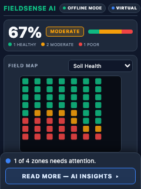
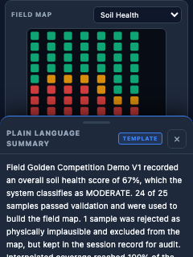
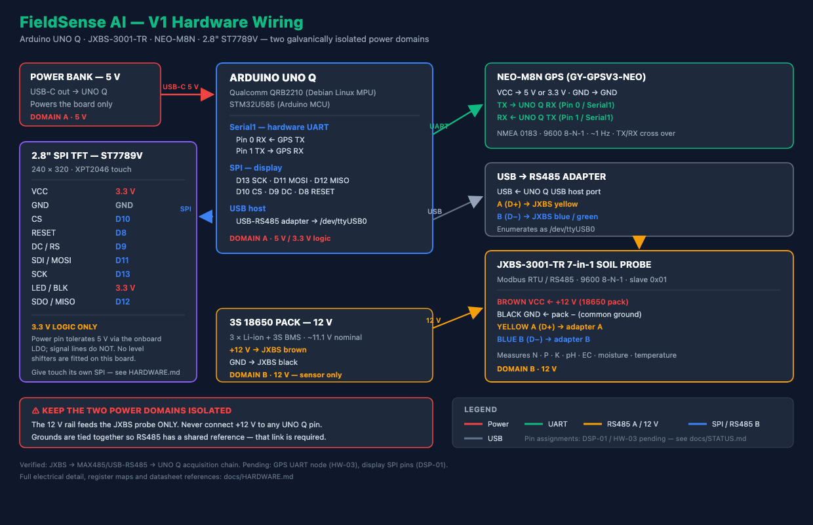
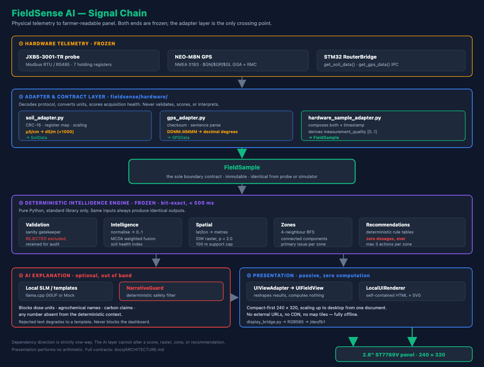

<div align="center">

# FieldSense AI

### Edge-Native Soil Intelligence & Autonomous Spatial Agronomy System



### A handheld, fully offline AI soil mapping system that helps farmers understand exactly where their field needs attention — before they leave the field.

**Built by Neha Priya & Lovshik Vinnu**
*Electronics & Communication Engineering*


*A portable instrument that reads soil at many points across a field, works out which patches need attention, and explains it in plain language — entirely offline, on a battery-powered board you can carry.*

</div>

---

## Why FieldSense AI?

> ### Because fields are not uniform — one corner is nitrogen-starved while another is waterlogged, and single-point lab tests miss the spatial variations that dictate crop yield.

A farmer fertilises at **one rate, everywhere**. So half the field is underfed and half is over-fertilised. The over-fertilised half is the expensive half: surplus nitrogen leaches into groundwater, salts build up, soil structure degrades — and next season needs *more* input for the same yield.

Lab testing would catch it, but the economics don't work: **1–2 weeks** for results, and cost-per-sample means 2–3 samples for an entire field. Far too coarse to see what matters.

FieldSense takes **~25 GPS-tagged readings in one walk** and returns a zone map **before you leave the field**.

|  | Lab testing | FieldSense AI |
| :--- | :--- | :--- |
| **Turnaround** | 1–2 weeks | Seconds, in-field |
| **Spatial resolution** | 2–3 points per field | ~25 points → continuous map |
| **Connectivity** | Courier + lab | None. Fully offline |
| **Output** | A number sheet | Colour-coded zones + guidance |

---

## Soil → Decision

How a probe insertion becomes an actionable zone map. Every stage runs **on the board**.

```
 ┌────────────────────────────────┐
 │  📍  PROBE SAMPLE + GPS TAG    │  7 parameters + position, ~2 s per point
 └───────────────┬────────────────┘  N · P · K · pH · EC · moisture · temp
                 ▼
 ┌────────────────────────────────┐
 │  🛡️  INSERTION VALIDATION      │  physically impossible readings never
 └───────────────┬────────────────┘  reach the map — kept for audit
                 ▼
 ┌────────────────────────────────┐
 │  🧮  DETERMINISTIC SCORING     │  raw units → 0–1 optimality
 └───────────────┬────────────────┘  weighted fusion → soil health index
                 ▼
 ┌────────────────────────────────┐
 │  🗺️  SPATIAL IDW INTERPOLATION │  ~25 sparse points → continuous surface
 └───────────────┬────────────────┘  inverse-distance weighting, p = 2.0
                 ▼
 ┌────────────────────────────────┐
 │  🧩  ZONE CLUSTERING  (A–D)    │  4-neighbour BFS groups touching cells
 └───────────────┬────────────────┘  into contiguous management zones
                 ▼
 ┌────────────────────────────────┐
 │  🤖  GUARDED AI EXPLANATION    │  plain language, safety-filtered
 └───────────────┬────────────────┘  cannot invent a dosage or a number
                 ▼
 ┌────────────────────────────────┐
 │  📱  ON-DEVICE 2.8" UI         │  score · zone bar · map · guidance
 └────────────────────────────────┘
```

### From scattered points to contiguous zones

The core trick: **you cannot walk every square metre**, so the field between your samples has to be reconstructed, then cut into patches a farmer can actually act on.

```
   ~25 probe points              continuous surface             management zones
   (what you measure)            (IDW interpolation)            (BFS clustering)

      ·    ·    ·                  ▓▓▓▒▒▒░░░░░                   ┌──── A ────┐
                                   ▓▓▒▒▒▒░░░░░                   │  HEALTHY  │
      ·    ·    ·         ──►      ▓▒▒▒▒▒▒░░░░       ──►         ├─── B ──┬──┘
                                   ▒▒▒▒▒▒▒▒▒░░                   │MODERATE│
      ·    ·    ·                  ▒▒▒░░░▒▒▒▒▒                   ├── C ───┴───┐
                                   ░░░░░░░▒▒▒▒                   │    POOR    │
      ·    ·    ·                  ░░░░░░░░▒▒▒                   └────────────┘

   sparse, unusable          every cell has a value        4 zones, each with
   on its own                                              one primary issue
```

Each zone gets **its own diagnosis** — *"Zone C: lower moisture than the surrounding area, high spatial confidence, review irrigation timing here"* — instead of one number for the whole field.

> **What it deliberately does not do.** FieldSense never prescribes a dosage. No *"apply 25 kg/acre urea."* It says *"review nitrogen management in this zone."* A wrong number here damages real soil and real livelihoods, so quantities are **structurally impossible to emit**: the rule tables cannot produce one, and `NarrativeGuard` blocks the language model from inventing one.

---

## The Interface

Compact-first. One HTML document serves the 240 × 320 panel and a laptop.

<div align="center">

| Field panel — 240 × 320 | AI insights drawer |
| :---: | :---: |
|  |  |
| Score, colour-coded zone bar, field map and a one-line teaser — all above the fold | Tapping **Read More** slides the explanation up **without covering the map** |

</div>


**Open the live dashboard:** [`artifacts/fieldsense_competition_demo.html`](artifacts/fieldsense_competition_demo.html) — committed to the repo, a single self-contained file with zero external requests. Rebuild it any time with `python3 -m fieldsense.demo`. The panel images above are captured from that same renderer, so this is exactly what the hardware shows.

---

## Hardware



### Power — two isolated domains

The single most important wiring rule in this build.

| Domain | Source | Feeds |
| :--- | :--- | :--- |
| **A — 5 V** | USB power bank → UNO Q USB-C | The board, GPS, display |
| **B — 12 V** | 3S 18650 pack (3 × Li-ion + BMS) | **JXBS soil probe only** |

> ⚠️ **Never connect +12 V to any UNO Q pin.** The rails stay separate.
> **Grounds must be tied together** — RS485 is differential and needs a shared reference. Without that link you get silence or nonsense.

### Pinout

**🌱 JXBS soil probe — Modbus RTU / RS485**

| Wire | Signal | Connects to |
| :--- | :--- | :--- |
| Brown | VCC | **+12 V** from the 18650 pack |
| Black | GND | Pack −, tied to UNO Q GND |
| Yellow | RS485 **A** (D+) | Adapter terminal A |
| Blue / Green | RS485 **B** (D−) | Adapter terminal B |

`JXBS → USB-RS485 adapter → UNO Q USB host → /dev/ttyUSB0` · `9600 8-N-1` · slave `0x01` · function `0x03`

**📡 NEO-M8N GPS — UART / NMEA 0183**

| Module pin | UNO Q |
| :--- | :--- |
| VCC | 5 V or 3.3 V |
| GND | GND |
| **TX** | **RX — Pin 0** (Serial1) |
| **RX** | **TX — Pin 1** (Serial1) |

> ⚠️ TX and RX **cross over**. Straight-through wiring is the most common reason a GPS looks dead.

**🖥️ 2.8" SPI TFT — ST7789V + XPT2046 touch**

| Display pin | UNO Q | | Display pin | UNO Q |
| :--- | :--- | :--- | :--- | :--- |
| VCC | 3.3 V | | SDI / MOSI | **D11** |
| GND | GND | | SCK | **D13** |
| CS | **D10** | | LED / BLK | 3.3 V |
| RESET | **D8** | | SDO / MISO | **D12** |
| DC / RS | **D9** | | | |

> ⚠️ **3.3 V logic only.** The power pin tolerates 5 V via an onboard LDO — the **signal** lines do not, and no level shifters are fitted.
> ⚠️ Controller is **ST7789V**, not ILI9341. These boards are widely mislabelled; an ILI9341 driver will not initialise this panel.

Full electrical specs, verified register maps and datasheet references → **[docs/HARDWARE.md](docs/HARDWARE.md)**

---

## Architecture



The hardware side and the software side are both **frozen**. An adapter layer is the only crossing point, and `FieldSample` is the only contract that crosses it.

| Principle | What it means |
| :--- | :--- |
| **Deterministic core** | Identical inputs → bit-identical outputs. Every number traces to an explicit formula. |
| **No dosages, ever** | Rule tables structurally cannot emit `kg/ha` or litres. |
| **AI cannot compute** | The model only narrates. `NarrativeGuard` blocks dose units, agrochemical names, carbon claims, and any number absent from the deterministic context. |
| **One adapter boundary** | Unit conversion happens once, in `fieldsense/hardware/`. Adapters never validate or score. |
| **Zero dependencies** | `dependencies = []`. Standard library only; `llama.cpp` and the browser are optional system assets. |

### Handbooks

| Document | What it covers |
| :--- | :--- |
| 🏗️ **[Architecture](docs/ARCHITECTURE.md)** | Module contracts, algorithms, decision log, frozen contracts |
| 🔌 **[Hardware Specs](docs/HARDWARE.md)** | Component specs, register maps, wiring, datasheet references |
| 🚀 **[Integration Runbook](docs/INTEGRATION_RUNBOOK.md)** | Four-step bring-up: acquisition → contract → pipeline → display |
| 🧪 **[Testing Guide](TESTING_GUIDE.md)** | How to test every component, plus the test evidence register |
| 🤖 **[AI Safety & Deployment](docs/AI_DEPLOYMENT.md)** | Local SLM setup, `NarrativeGuard`, and the display bridge |
| 📋 [Status & Open Items](docs/STATUS.md) · [Project Handbook](docs/PROJECT_HANDBOOK.md) · [Demo Guide](docs/DEMO_GUIDE.md) | Requirements matrix, purpose, presentation walkthrough |

---

## Quickstart

Python 3.10+. **No runtime dependencies.**

```bash
python3 -m pip install -e ".[dev]"
```

**Run the tests** — 231 should pass:

```bash
python3 -m pytest -q
```

**Execute the full pipeline:**

```bash
python3 -m fieldsense.demo
```

```
Samples:            25 Total | 24 Valid | 1 Rejected
Overall Health:     67% [MODERATE]
Zones Detected:     4 Spatially Connected Management Zones
Explanation Layer:  MOCK_TEMPLATE_v1 [FALLBACK_TEMPLATE] | Guard Blocks: 0
Dashboard Artifact: artifacts/fieldsense_competition_demo.html
```

The `1 Rejected` is deliberate — the dataset plants one unstable sample so you can watch the validation gatekeeper work.

**Launch the display:**

```bash
./scripts/launch_display.sh
```

Run `./scripts/launch_display.sh probe` first — it reports what your machine can do and changes nothing. Without the panel, `png` writes the exact 240 × 320 frame instead.

---

## Status

| ✅ Complete | ⚠️ Pending hardware |
| :--- | :--- |
| Deterministic pipeline · 231 tests | GPS wired to UNO Q (`HW-03`) |
| Hardware → `FieldSample` adapter layer | Display on QRB2210 SPI (`DSP-01`/`DSP-02`) |
| AI explanation + `NarrativeGuard` | Touch events reaching the UI (`DSP-05`) |
| Offline dashboard · 240 × 320 + desktop | On-target timing benchmark (`PF-01`) |
| Display bridge → RGB565 framebuffer | |
| Probe → MAX485 → UNO Q, verified end-to-end | |

**Honest limitation.** The scoring curves and MCDA weights are unvalidated prototype values at `methodology_version = "0.1"`. Every hardware test above can pass while the agronomic interpretation remains unproven — *"the sensor chain works"* and *"the soil advice is correct"* are different claims, and only the first is currently evidenced.

Full register of open items → **[docs/STATUS.md](docs/STATUS.md)**

---

<div align="center">

**FieldSense AI** · Built for farmers who need answers in the field, not in two weeks.

</div>
