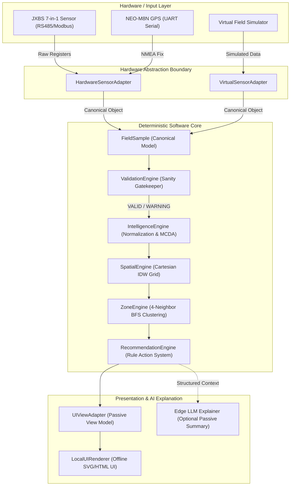
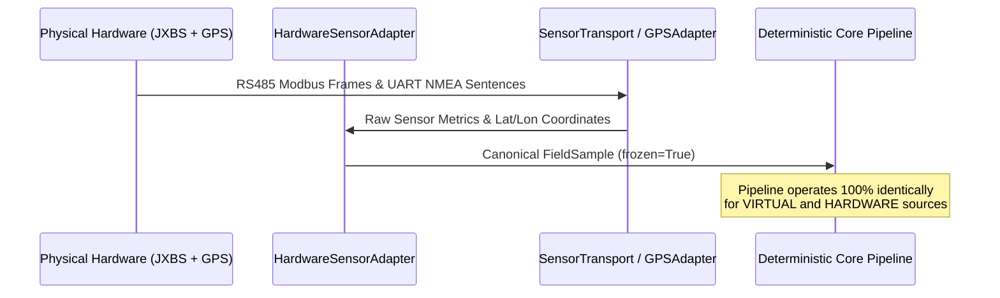
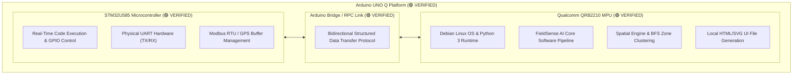

# FieldSense AI — Architecture

The authoritative architecture reference. Consolidates what were previously three
separate documents:

| Part | Was | Covers |
| :--- | :--- | :--- |
| I | `SYSTEM_ARCHITECTURE.md` | System-level design, MCU/MPU split, data flow |
| II | `SOFTWARE_SPEC.md` | Module contracts, algorithms, configuration |
| III | `DECISION_LOG.md` | Why each architectural decision was made |
| IV | `03_ARCHITECTURE.md` §29–30 | Frozen contracts and the change-control protocol |

The originals are kept in [`archive/`](archive/), each stamped as superseded.
Two of them are not fully absorbed: the *Verified Hardware Paths* sections of
[`archive/SYSTEM_ARCHITECTURE.md`](archive/SYSTEM_ARCHITECTURE.md) and
[`archive/SOFTWARE_SPEC.md`](archive/SOFTWARE_SPEC.md) were written after the
consolidation and still live only there.

Hardware specifications live in [HARDWARE.md](HARDWARE.md).
Runtime deployment lives in [AI_DEPLOYMENT.md](AI_DEPLOYMENT.md).

---

## Part I — System Architecture

**STATUS:** DRAFT  
**VERSION:** 0.1  
**LAST UPDATED:** 2026-08-22  
**ARCHITECTURE STATUS:** FROZEN (`PHASE_1_RELEASE_READY`)  

---

### 1. Overall System Architecture

FieldSense AI is designed around a strictly decoupled, 8-stage canonical processing pipeline. The architecture enforces hardware independence, deterministic calculation, passive presentation, and total offline sovereignty.



---

### 2. Hardware / Software Boundary

The system isolates hardware transport protocols inside `fieldsense/hardware/`. Neither the downstream validation, scoring, spatial, zone, recommendation, nor UI modules contain hardware-specific logic.



---

### 3. Data Flow

Data flows strictly in one direction from acquisition to visualization:

```text
JXBS Sensor (RS485) ──┐
                      ├──> HardwareSensorAdapter ──┐
NEO-M8N GPS (UART) ───┘                            │
                                                   ├──> FieldSample (Immutable)
Virtual Simulator ───────> VirtualSensorAdapter ──┘
                                │
                                ▼
                         ValidationEngine
                        /                \
               [REJECTED]                [VALID / WARNING]
                   │                             │
            Audit Log Only                       ▼
                                        IntelligenceEngine
                                       (Normalization/MCDA)
                                                 │
                                                 ▼
                                           SpatialEngine
                                        (Cartesian Meter IDW)
                                                 │
                                                 ▼
                                            ZoneEngine
                                      (4-Neighbor BFS Clustering)
                                                 │
                                                 ▼
                                        RecommendationEngine
                                         (Traceable Rules)
                                                 │
                                                 ▼
                                           UIViewAdapter
                                                 │
                                                 ▼
                                          LocalUIRenderer
                                       (Standalone Offline SVG/HTML)
```

---

### 4. Arduino UNO Q Dual-Core Architecture

The target hardware platform is the **Arduino UNO Q**, featuring a dual-processor architecture with an internal high-speed IPC bridge:

```text
                     Arduino UNO Q
              ┌──────────────────────┐
              │                      │
              │ STM32U585 MCU        │
              │ Hardware peripherals │
              │ UART / GPIO          │
              │        │             │
              │        ▼             │
              │ Arduino Bridge/RPC   │
              │        │             │
              │        ▼             │
              │ QRB2210 Linux        │
              │ Python / FieldSense  │
              │                      │
              └──────────────────────┘
```



#### Verified Platform Capabilities (`🟢 VERIFIED`)
- **Power & Boot**: Clean boot, stable Linux OS execution (`🟢 VERIFIED`).
- **STM32U585 MCU**: Code execution, GPIO pin control, physical UART hardware (`🟢 VERIFIED`).
- **Qualcomm QRB2210 Linux**: Python runtime execution, continuous data processing loops (`🟢 VERIFIED`).
- **Arduino Bridge / RPC**: Bidirectional structured data flow between STM32 MCU and Linux/Python (`🟢 VERIFIED`).
- **Physical UART**: Real physical voltage-level UART TX/RX signal activity verified on board (`🟢 VERIFIED`).

#### Peripheral Integration Status (`🟡 PENDING V1 INTEGRATION`)
- **NEO-M8N GPS → UNO Q Integration**: `🟡 PENDING V1 INTEGRATION`
- **JXBS Soil Sensor → MAX485 → UNO Q Integration**: `🟡 PENDING V1 INTEGRATION`
- **ST7789 + XPT2046 TFT → UNO Q Integration**: `🟡 PENDING V1 INTEGRATION`
- **End-to-End FieldSample Hardware Pipeline**: `🟡 PENDING V1 INTEGRATION`

#### STM32U585 MCU Responsibilities
- Real-time peripheral timing management.
- RS485 DE/RE transceiver direction switching.
- Modbus RTU polling frame transmission and CRC verification.
- UART serial ring buffer management for NEO-M8N NMEA sentences.

#### Qualcomm QRB2210 MPU Responsibilities
- Executes Python standard library runtime.
- Runs the 8-stage deterministic FieldSense pipeline.
- Performs Cartesian spatial projection and IDW raster interpolation.
- Executes 4-neighbor BFS graph component clustering.
- Generates single-file self-contained HTML/CSS/SVG dashboard artifacts.

---

### 5. Arduino Bridge / RPC & Sensor -> FieldSample Flow

*(Hardware Status: Arduino UNO Q Platform, JXBS 7-in-1 Soil Sensor, NEO-M8N GPS Breakout, MAX485 RS485 Interface, & 2.8" ST7789 + XPT2046 Display = `VERIFIED AS INDIVIDUAL COMPONENTS`; System Peripheral Wiring & End-to-End Pipeline = `🟡 PENDING V1 INTEGRATION`)*

The communication link between the physical sensors, STM32 real-time MCU, and QRB2210 Linux MPU uses the verified MAX485 physical layer transceiver and the verified Arduino Bridge / RPC Inter-Process Communication (IPC) link:

```text
[ JXBS Sensor ] ──(RS485 A/B)──> [ MAX485 Transceiver ] ──(TTL UART)──> [ STM32 MCU ] ──(Bridge/RPC 🟢)──> [ QRB2210 Linux ]
                                                                                                                   │
                                                                                                                   ▼
                                                                                                         HardwareSensorAdapter
                                                                                                                   │
                                                                                                                   ▼
                                                                                                         FieldSample Instance
```

> [!NOTE]
> All core hardware components—the Arduino UNO Q platform, MAX485 RS485 transceiver module, NEO-M8N GPS module, JXBS 7-in-1 soil probe, and 2.8" ST7789 + XPT2046 Display—are now **VERIFIED** at the component level. The project is now entering V1 system integration, where the verified components will be connected and validated as a complete end-to-end system.

1. **Physical Acquisition**: MAX485 converts RS485 differential signals from JXBS probe to TTL UART for STM32 MCU. STM32 issues Modbus RTU read holding registers request (`0x0000–0x0020`).
2. **Buffer & Validate CRC**: STM32 checks frame CRC and caches raw 16-bit integer registers.
3. **IPC Transfer**: STM32 passes raw metrics and GPS sentences over verified Arduino Bridge / RPC to QRB2210 Linux `/dev` node.
4. **Adapter Conversion**: `HardwareSensorAdapter` running on QRB2210 converts raw register values and NMEA coordinates into a canonical `FieldSample` object tagged `source = SampleSource.HARDWARE`.

---

### 6. Software Pipeline & Major Interfaces

The software is structured into 11 strictly decoupled Python modules:

| Module Path | Responsibility | Primary Interface / Class |
| :--- | :--- | :--- |
| `fieldsense/domain/` | Core data contracts & enums | `FieldSample`, `FieldSession`, `SampleSource`, `ValidationState` |
| `fieldsense/input/` | Virtual field simulation | `SensorAdapter`, `VirtualSensorAdapter`, `VirtualFieldGenerator` |
| `fieldsense/hardware/` | Physical hardware integration | `HardwareSensorAdapter`, `SensorTransport`, `GPSAdapter` |
| `fieldsense/intelligence/validation/` | Physical sanity gatekeeper | `ValidationEngine`, `ValidationResult` |
| `fieldsense/intelligence/normalization/`| Piecewise metric scoring | `SampleNormalizer` |
| `fieldsense/intelligence/scoring/` | MCDA Soil Health & Carbon proxy | `IntelligenceEngine`, `ScoringEngine`, `FieldIntelligenceResult` |
| `fieldsense/spatial/` | Local Cartesian IDW raster | `SpatialEngine`, `IDWInterpolator`, `SpatialGrid` |
| `fieldsense/zones/` | 4-neighbor BFS zone clustering | `ZoneEngine`, `Zone`, `ZoneDetectionResult` |
| `fieldsense/recommendations/` | Rule-based action engine | `RecommendationEngine`, `RecommendationRule` |
| `fieldsense/presentation/` | Passive view model & HTML/SVG renderer | `UIViewAdapter`, `UIFieldView`, `LocalUIRenderer` |
| `fieldsense/storage/` | Data serialization | `to_dict()`, `from_dict()` helper protocols |

#### Dependency Hierarchy & Module Direction
Dependencies enforce a strict unidirectional flow:

$$\text{Hardware / Input} \longrightarrow \text{Domain} \longrightarrow \text{Validation / Scoring} \longrightarrow \text{Spatial} \longrightarrow \text{Zones} \longrightarrow \text{Recommendations} \longrightarrow \text{Presentation}$$

##### Forbidden Dependency Violations (Architectural Defects)
- $\text{Presentation} \longrightarrow \text{Intelligence Scoring}$ (UI must never compute scores)
- $\text{Hardware} \longrightarrow \text{Recommendations}$ (Hardware must not access agronomic rules)
- $\text{Spatial} \longrightarrow \text{Presentation}$ (Spatial engine must remain UI-agnostic)
- $\text{Domain} \longrightarrow \text{External Libraries}$ (Domain models must remain pure Python)
- $\text{LLM / AI} \longrightarrow \text{Deterministic Core}$ (AI must never compute scores or zones)

---

### 7. Offline Architecture & Sovereignty

FieldSense AI is designed for 100% network-isolated execution:

```text
┌─────────────────────────────────────────────────────────────┐
│                    OFFLINE EDGE CONTAINER                   │
│                                                             │
│  [ Local Dataclasses ] ──> [ Native Math Calculations ]     │
│                                     │                       │
│                                     ▼                       │
│                       [ SVG String Vector Engine ]          │
│                                     │                       │
│                                     ▼                       │
│                        [ Local Single-File HTML ]           │
└─────────────────────────────────────────────────────────────┘
```

- **Zero Cloud APIs**: No HTTP/HTTPS calls during runtime execution.
- **Native Vector Engine**: Visual heatmaps and grid tiles are rendered as inline SVG strings generated by Python string builders.
- **Zero Web CDNs**: CSS flexbox layouts and inline SVG elements are self-contained inside `LocalUIRenderer`.

---

### 8. Decoupled AI Explanation Boundary

The future AI Explanation Layer exists strictly downstream as an optional, passive summary consumer:

```text
┌───────────────────────────┐
│ Deterministic Processing  │
│      Results Package      │
└─────────────┬─────────────┘
              │ Structured JSON Context
              ▼
┌───────────────────────────┐
│    Edge LLM Explainer     │
│ (llama.cpp / ONNX local)  │
└─────────────┬─────────────┘
              │
              ▼
┌───────────────────────────┐
│ Farmer Natural Language   │
│   Summary & Voice Guidance│
└───────────────────────────┘
```

#### Strict AI Safety Rules
1. The AI module consumes `FieldIntelligenceResult`, `ZoneDetectionResult`, and `RecommendationResult` as read-only context.
2. The AI module **NEVER** computes, modifies, or overrides soil scores or management zone boundaries.
3. The AI module **NEVER** outputs quantitative chemical, fertilizer, or water prescription amounts.

---

### 9. Future Architectural Extensions

1. **SQLite Session Persistence Layer**: Replace JSON file dumps with an embedded SQLite database for historical session storage and multi-temporal trend analysis.
2. **On-Device LCD Framebuffer Driver**: Extend `fieldsense/presentation/` to render direct framebuffer graphics on 7-inch LCD touchscreens attached to the Arduino UNO Q platform.
3. **Local Quantized LLM Explainer**: Package `llama-cpp-python` with Phi-3 or Llama-3-8B quantized GGUF models for offline voice and conversational Q&A on the Qualcomm QRB2210 MPU.

---

## Part II — Software Specification

**STATUS:** DRAFT  
**VERSION:** 0.1  
**LAST UPDATED:** 2026-08-21  
**SOFTWARE BASELINE:** FROZEN (`PHASE_1_RELEASE_READY`)  

---

### 1. Software Architecture & Repository Structure

FieldSense AI is structured into 11 strictly decoupled Python modules under the core `fieldsense/` package namespace. All modules use Python 3.10+ standard libraries exclusively (`dataclasses`, `enum`, `datetime`, `math`, `json`, `uuid`, `xml.etree`). Heavy third-party dependencies (e.g. NumPy, SciPy, Pandas, PyTorch) are strictly prohibited.

```text
fieldsense/
├── domain/            # Pure data contracts (FieldSample, FieldSession, Enums)
├── input/             # Virtual sensor simulation adapter
├── hardware/          # Hardware transports, GPS adapter, HardwareSensorAdapter
├── intelligence/      # Validation, normalization, and MCDA scoring engines
│   ├── validation/    # Gatekeeper validation engine & sanity thresholds
│   ├── normalization/ # Metric normalization & reference band functions
│   └── scoring/       # Component indices (Soil Health, N, Moisture, Carbon)
├── spatial/           # Cartesian projection, bounds, grid, and IDW interpolator
├── zones/             # 4-neighbor BFS graph zone detection & merging engine
├── recommendations/   # Rule-based decision-support engine & agronomic rules
├── presentation/      # UIViewAdapter and standalone offline HTML/SVG renderer
├── storage/           # Session serialization abstractions
├── testing/           # Golden scenarios, fault injection, & benchmark suites
└── demo.py            # End-to-end competition showcase runner
```

---

### 2. Canonical Domain Model — FieldSample

`FieldSample` (`fieldsense/domain/models/sample.py`) is the immutable canonical data contract representing a single physical or virtual soil observation.

#### Invariants & Guarantees
1. **Immutability**: Class is decorated `@dataclass(frozen=True)`. Raw readings cannot be silently altered downstream.
2. **Canonical Data Container**: All downstream validation, scoring, spatial, and presentation engines consume `FieldSample` instances exclusively.
3. **Serialization Integrity**: Implements `to_dict()` and `from_dict()` with strict ISO-8601 UTC timestamp parsing.

#### Schema Fields

| Field Name | Type | Physical Units | Constraints / Valid Range |
| :--- | :--- | :--- | :--- |
| `sample_id` | `str` | UUIDv4 | Non-empty string |
| `timestamp` | `datetime` | ISO-8601 UTC | Valid timezone-aware datetime |
| `latitude` | `float` | Decimal Degrees | $[-90.0, +90.0]$ |
| `longitude` | `float` | Decimal Degrees | $[-180.0, +180.0]$ |
| `nitrogen` | `float` | $\text{mg/kg}$ (ppm) | $[0.0, 1000.0]$ |
| `phosphorus` | `float` | $\text{mg/kg}$ (ppm) | $[0.0, 500.0]$ |
| `potassium` | `float` | $\text{mg/kg}$ (ppm) | $[0.0, 1500.0]$ |
| `ph` | `float` | $\text{pH}$ scale | $[0.0, 14.0]$ |
| `ec` | `float` | $\mu\text{S/cm}$ | $[0.0, 20000.0]$ |
| `moisture` | `float` | $\text{VWC}\%$ | $[0.0, 100.0]$ |
| `temperature` | `float` | $^\circ\text{C}$ | $[-40.0, +80.0]$ |
| `measurement_quality`| `float` | Confidence scale | $[0.0, 1.0]$ |
| `source` | `SampleSource`| Enum | `VIRTUAL` or `HARDWARE` |
| `validation_state` | `ValidationState`| Enum | `VALID`, `VALID_WITH_WARNING`, `REJECTED` |

---

### 3. Sampling Campaign Model — FieldSession

`FieldSession` (`fieldsense/domain/models/session.py`) encapsulates a complete multi-sample field acquisition campaign.

#### Behavioral Rules
- **Attributes**: `session_id`, `name`, `created_at`, `status` (`ACTIVE`, `COMPLETED`, `ABORTED`), `samples` (`List[FieldSample]`), `metadata` (`dict`).
- **Raw Sample Integrity**: `FieldSession.samples` retains **all** collected samples—including rejected ones—guaranteeing operational auditability.
- **Read-Only Pipeline Filtering**: The property `valid_samples` filters for samples marked `pipeline_eligible = True` without mutating the underlying `samples` list.

---

### 4. Sensor Abstraction Boundary

`SensorAdapter` (`fieldsense/domain/contracts/sensor.py`) defines the abstract interface for all data acquisition sources:

```python
class SensorAdapter(ABC):
    @abstractmethod
    def initialize(self) -> bool: ...
    @abstractmethod
    def acquire_sample(self, lat: float, lon: float) -> FieldSample: ...
    @abstractmethod
    def shutdown(self) -> None: ...
```

#### Implementations
- `VirtualSensorAdapter` (`fieldsense/input/virtual_sensor.py`): Generates deterministic multi-point test fields with configurable gradients, Gaussian hotspots, noise levels, fixed seeds, and fault profiles (`OUTLIER`, `UNSTABLE_MEASUREMENT`).
- `HardwareSensorAdapter` (`fieldsense/hardware/sensor_adapter.py`): Interfaces with physical hardware transports (`SensorTransport` and `GPSAdapter`), converting Modbus registers and NMEA strings into canonical `FieldSample` objects.

---

### 5. Automated Validation Engine

`ValidationEngine` (`fieldsense/intelligence/validation/engine.py`) acts as the automated data quality gatekeeper.

#### Validation State Hierarchy & Rules
1. `REJECTED`: Triggered when physical metrics violate hard physical limits (e.g. $\text{pH} > 14$, $\text{Moisture} < 0\%$) or exhibit hardware instability flags.
   - **Behavior**: Flagged `pipeline_eligible = False`. Excluded from spatial raster interpolation and zone clustering, but preserved in `FieldSession` diagnostics for auditability.
2. `VALID_WITH_WARNING`: Triggered when metrics fall on operational boundaries (e.g. extremely high EC).
   - **Behavior**: Flagged `pipeline_eligible = True`. Included in spatial rasters with attached diagnostic warning codes.
3. `VALID`: Clean, physically plausible measurement.
   - **Behavior**: Flagged `pipeline_eligible = True`.

---

### 6. Normalization & Piecewise Scoring Curves

`SampleNormalizer` (`fieldsense/intelligence/normalization/normalizer.py`) converts raw physical values into dimensionless optimality scores $[0.0, 1.0]$.

- Uses non-linear piecewise linear functions and optimum reference bands (e.g., optimum soil $\text{pH}$ band $6.0 - 7.5$).
- Explicit Status: `PROTOTYPE_ONLY` / `AGRONOMIC_VALIDATION_REQUIRED` (`methodology_version = "0.1"`).

---

### 7. Deterministic Scoring Engine & MCDA

`IntelligenceEngine` (`fieldsense/intelligence/engine.py`) coordinates normalized metric scoring and component index synthesis.

#### Multi-Criteria Decision Analysis (MCDA) Weighting Vector
Overall **Soil Health Index** ($[0.0, 1.0]$) is computed using weighted MCDA aggregation:

$$\text{SoilHealth} = 0.20 S_N + 0.15 S_P + 0.15 S_K + 0.20 S_{\text{pH}} + 0.10 S_{\text{EC}} + 0.20 S_{\text{Moisture}}$$

#### Carbon Readiness Proxy Boundary
`CarbonReadinessResult` evaluates soil physical suitability for organic carbon retention:
- **Decision-Support Boundary**: Enforces `decision_support_only = True` and `evidence_level = "LIMITED"`.
- **Explicit Missing Indicators**:
  ```python
  missing_indicators = [
      "soil_organic_carbon",
      "bulk_density",
      "management_history"
  ]
  ```
- **Prohibited Claims**: Direct SOC mass measurement, carbon sequestration tonnage, and MRV/carbon credit certification claims are strictly prohibited.

---

### 8. Spatial Intelligence & IDW Interpolation Engine

`SpatialEngine` (`fieldsense/spatial/engine.py`) transforms discrete point observations into continuous 2D raster grids.

#### Spatial Algorithms & Rules
1. **Local Cartesian Meter Projection**: Latitude and longitude coordinates are projected into local Cartesian meters $(x,y)$ using equirectangular projection centered on sample centroid.
2. **Inverse Distance Weighting (IDW)**: Continuous surface values are calculated using power parameter $p=2.0$:
   $$w_i = \frac{1}{d_i^2}, \quad Z(x,y) = \frac{\sum w_i z_i}{\sum w_i}$$
3. **Minimum Sample Constraint**: Requires minimum $N \ge 3$ valid samples. If $N < 3$, spatial engine returns `is_valid = False` without attempting interpolation.
4. **Maximum Support Distance**: Capped at $100\text{m}$. Grid nodes located $> 100\text{m}$ from the nearest valid sample point return `None` (unsupported) to prevent arbitrary extrapolation.
5. **Default Grid Resolution**: Configurable $10\text{m} \times 10\text{m}$ grid cells.

---

### 9. Management Zone Detection Engine

`ZoneEngine` (`fieldsense/zones/engine.py`) partitions continuous spatial grids into discrete contiguous management zones.

#### Clustering Algorithms & Boundaries
1. **4-Neighbor BFS Graph Clustering**: Connects grid cells sharing adjacent edges into contiguous component regions.
2. **Zone Classifications**:
   - `HEALTHY`: Score $\ge 0.70$
   - `MODERATE`: $0.45 \le \text{Score} < 0.70$
   - `POOR`: Score $< 0.45$
3. **Small Component Merging**: Contiguous regions smaller than 2 grid cells ($< 200\text{m}^2$) are merged into neighboring zones.
4. **Primary Issue Identification**: Selected by lowest metric score with deterministic tie-breaking ($N > \text{Moisture} > \text{pH} > \text{Salinity}$).
5. **Spatial Support Confidence**: Indicates spatial sample density within the zone (`HIGH`, `MEDIUM`, `LOW`), **not** agronomic certainty.

---

### 10. Rule-Based Recommendation Engine

`RecommendationEngine` (`fieldsense/recommendations/engine.py`) evaluates detected zone issues against deterministic rule matrices to generate actionable recommendations.

#### Agronomic Safety & Prescription Rules
- **Rule Categories**: `NUTRIENT`, `WATER`, `SOIL_CONDITION`, `SALINITY`, `CARBON_READINESS`, `MONITORING`.
- **Directional Guidance Only**: Emits qualitative, traceable advice (e.g. *"Review nitrogen availability in Zone Z02"*).
- **ZERO QUANTITATIVE DOSAGES**: System **never** outputs chemical or fertilizer quantities (e.g. *"Apply 30 kg/ha Urea"*) or irrigation volumes.
- **Constraints**: Maximum 3 recommendations per zone; stable rule IDs; automated deduplication.

---

### 11. Passive Presentation Layer & Local UI Renderer

`LocalUIRenderer` (`fieldsense/presentation/renderer.py`) compiles self-contained HTML/CSS/SVG dashboards.

#### UI Contract & Presentation Boundaries
- **Passive Contract**: UI consumes `UIFieldView` view models built by `UIViewAdapter`. Contains zero calculation or scoring logic.
- **Zero External Network Dependencies**: Operates 100% offline without external JS libraries, remote CSS fonts, or web map tiles.
- **Native SVG Generation**: Renders continuous spatial raster heatmaps, management zones, and layer switching controls as inline SVG vector graphics.

---

### 12. Hardware Integration Adapter Boundary

Hardware communication interfaces (`fieldsense/hardware/`) isolate serial communication details:
- `HardwareSensorAdapter`: Adapts physical transports to `SensorAdapter` contract.
- `SensorTransport`: Abstract base class for serial communication (implemented by `MockHardwareTransport`).
- `GPSAdapter`: Abstract base class for NMEA position fixes (implemented by `MockGPSAdapter`).
- **Structured Exception Hierarchy**: `HardwareConnectionError`, `ModbusTimeoutError`, `GPSFixError`.

---

### 13. AI Explanation Boundary

The AI Explanation Layer is optional and strictly decoupled downstream:

$$\text{Deterministic Pipeline Results} \longrightarrow \text{Structured JSON Context} \longrightarrow \text{Edge LLM Explainer}$$

- Generative AI modules consume structured JSON output as read-only context.
- AI modules cannot recalculate, modify, or override deterministic scores, spatial maps, or recommendations.
- AI modules cannot invent quantitative chemical prescriptions or unverified carbon credit claims.

---

## Part III — Decision Log

**STATUS:** DRAFT  
**VERSION:** 0.1  
**LAST UPDATED:** 2026-08-21  

This document logs all major engineering, architectural, scientific boundary, and protocol decisions for FieldSense AI. Trivial implementation details are excluded.

---

#### D-001 — Frozen Domain Core & Immutability of FieldSample

**Date:** 2026-08-09  
**Status:** APPROVED / FROZEN  

**Decision:**  
Implement `FieldSample` as a pure, immutable (`frozen=True`) dataclass in Python standard library containing 14 canonical fields (`sample_id`, `timestamp`, `latitude`, `longitude`, `nitrogen`, `phosphorus`, `potassium`, `ph`, `ec`, `moisture`, `temperature`, `measurement_quality`, `source`, `validation_state`).

**Reason:**  
Prevents downstream processing engines (validation, scoring, spatial IDW, zone detection, presentation) from silently modifying raw observational measurements. Raw data integrity is preserved across the entire system lifecycle.

**Impact:**  
Downstream modules must create new objects or derived views rather than mutating raw samples. Raw data remains 100% auditable.

**Related system:**  
Domain Core (`fieldsense.domain.models.sample`)

---

#### D-002 — Sensor Abstraction & Hardware Independence

**Date:** 2026-08-09  
**Status:** APPROVED / FROZEN  

**Decision:**  
Establish an abstract `SensorAdapter` interface. Both `VirtualSensorAdapter` (simulation) and `HardwareSensorAdapter` (physical RS485/UART hardware) emit identical, immutable `FieldSample` objects.

**Reason:**  
Enables complete software pipeline development, spatial algorithm testing, and local UI rendering prior to physical hardware availability, guaranteeing 100% code reuse when physical sensors are connected.

**Impact:**  
Downstream engines are 100% agnostic to data origin (`SampleSource.VIRTUAL` vs `SampleSource.HARDWARE`). Zero downstream code changes are required when switching sources.

**Related system:**  
Input & Hardware Abstraction Boundary (`fieldsense.input`, `fieldsense.hardware`)

---

#### D-003 — Automated Validation Gatekeeper & Raw Sample Retention

**Date:** 2026-08-09  
**Status:** APPROVED / FROZEN  

**Decision:**  
Implement `ValidationEngine` to sanitize raw measurements before spatial processing. Samples violating physical bounds are tagged `REJECTED` and `pipeline_eligible = False`. Rejected samples are excluded from spatial interpolation but remain preserved in `FieldSession.samples`.

**Reason:**  
Prevents corrupted sensor data or electrical noise from corrupting spatial maps and management zones while preserving complete operational data lineage for auditability.

**Impact:**  
Spatial and zone engines filter for `pipeline_eligible` samples, while diagnostics cards report rejected samples with failure reason codes.

**Related system:**  
Validation Engine (`fieldsense.intelligence.validation`)

---

#### D-004 — 100% Deterministic Core (No LLM in Analytical Path)

**Date:** 2026-08-09  
**Status:** APPROVED / FROZEN  

**Decision:**  
All validation, normalization scoring, MCDA aggregation, spatial IDW interpolation, 4-neighbor BFS zone detection, and recommendation rules must execute 100% deterministically using explicit mathematical algorithms. Large Language Models (LLMs) are forbidden from calculating or modifying scores.

**Reason:**  
Guarantees mathematical reproducibility, complete auditability, zero AI hallucination risk, and rapid execution ($< 50\text{ms}$) on resource-constrained edge hardware.

**Impact:**  
LLMs are strictly isolated downstream as optional, passive summary explainers that consume structured JSON results.

**Related system:**  
Intelligence, Spatial, Zone, and Recommendation Engines

---

#### D-005 — Carbon Readiness Scientific & Agronomic Safety Boundary

**Date:** 2026-08-09  
**Status:** APPROVED / FROZEN  

**Decision:**  
Carbon Readiness is strictly defined as an engineering decision-support proxy index (`decision_support_only = True`, `evidence_level = "LIMITED"`). Direct Soil Organic Carbon (SOC) mass claims, carbon tonnage calculations, and MRV/carbon credit certification claims are strictly prohibited. Missing indicators (`soil_organic_carbon`, `bulk_density`, `management_history`) are explicitly declared.

**Reason:**  
Physical 7-in-1 sensors ($N, P, K, \text{pH}, \text{EC}, \text{Moisture}, \text{Temp}$) do not measure direct soil carbon. Claiming carbon credit verification based only on proxy sensors is scientifically invalid.

**Impact:**  
UI dashboards, exports, and reports explicitly display safety warnings and proxy limits.

**Related system:**  
Intelligence Scoring (`fieldsense.intelligence.scoring`)

---

#### D-006 — Non-Prescriptive Directional Guidance in Recommendation Engine

**Date:** 2026-08-09  
**Status:** APPROVED / FROZEN  

**Decision:**  
The recommendation engine outputs qualitative directional advice (e.g. *"Review nitrogen availability"*) and strictly prohibits quantitative fertilizer or chemical dosage figures (e.g. *"Apply 25 kg/acre urea"*) or irrigation volumes.

**Reason:**  
Quantitative chemical prescriptions require laboratory soil buffer testing and localized crop response calibration. Emitting unverified chemical dosages creates severe agronomic and safety risks for farmers.

**Impact:**  
Recommendation rules remain safe, traceable, non-prescriptive, and category-mapped.

**Related system:**  
Recommendation Engine (`fieldsense.recommendations`)

---

#### D-007 — Equirectangular Cartesian Projection & Capped IDW Support Distance

**Date:** 2026-08-09  
**Status:** APPROVED / FROZEN  

**Decision:**  
Project geographic GPS coordinates to local Cartesian meters $(x,y)$ using equirectangular projection centered on sample centroid. Execute IDW interpolation ($p=2.0$) with max support distance capped at $100\text{m}$ and minimum valid sample count $N \ge 3$.

**Reason:**  
Avoids heavy GIS dependencies (e.g., GDAL, PROJ) while providing accurate distance math for field-scale plots ($< 10\text{km}$). Capping support distance prevents arbitrary spatial extrapolation into unmonitored field areas.

**Impact:**  
Grid nodes $> 100\text{m}$ from the nearest valid sample point return `value = None` (unsupported).

**Related system:**  
Spatial Engine (`fieldsense.spatial`)

---

#### D-008 — Passive Presentation Layer & Local Offline Renderer

**Date:** 2026-08-09  
**Status:** APPROVED / FROZEN  

**Decision:**  
Map backend intelligence objects to passive `UIFieldView` view models via `UIViewAdapter`. Render local dashboards using `LocalUIRenderer` compiling single-file HTML with inline CSS and native Python SVG vector graphics. Zero external CDN, font, or web map dependencies.

**Reason:**  
Guarantees 100% offline sovereignty on edge devices in remote agricultural fields without internet connectivity.

**Impact:**  
Presentation layer contains zero calculation logic. Dashboard opens instantly in any standard web browser.

**Related system:**  
Presentation Layer (`fieldsense.presentation`)

---

#### D-009 — Standard Library Execution Architecture

**Date:** 2026-08-09  
**Status:** APPROVED / FROZEN  

**Decision:**  
Build the software pipeline using Python standard libraries exclusively (`dataclasses`, `enum`, `datetime`, `math`, `json`, `uuid`, `xml.etree`). Prohibit heavy third-party packages (NumPy, SciPy, Pandas, PyTorch).

**Reason:**  
Enables lightweight deployment on target Debian Linux edge hardware (Qualcomm QRB2210 on Arduino UNO Q) with $< 25\text{MB}$ RAM footprint and sub-50ms execution times.

**Impact:**  
Zero complex package installation or binary cross-compilation required for edge hardware.

**Related system:**  
Entire System Architecture

---

#### D-010 — Physical JXBS 7-in-1 Register Mapping & Byte-Framed Modbus Read Strategy

**Date:** 2026-08-22  
**Status:** APPROVED / CONFIRMED  

**Decision:**  
Adopt the empirical JXBS 7-in-1 Modbus RTU register map (`0x0006` pH, `0x0012` Moisture, `0x0013` Temperature, `0x0015` EC, `0x001E` Nitrogen, `0x001F` Phosphorus, `0x0020` Potassium) and enforce explicit 7-byte read buffer framing (`ser.read(7)` with timeout) over serial transport.

**Reason:**  
Empirical hardware bench testing demonstrated that relying on `ser.read(ser.in_waiting)` creates buffer race conditions returning 0 bytes before Modbus frame arrival over RS485. Fixed-length 7-byte reads with serial timeout guarantee frame arrival and 100% Modbus CRC pass rate.

**Impact:**  
Hardware sensor adapter and test drivers read physical sensor registers reliably without frame truncation or silent empty buffer reads.

**Related system:**  
Hardware Interface Boundary (`fieldsense.hardware`, `hardware/soil-probe/jxbs_test.py`)

---

## Part IV — Frozen Contracts & Change Control

> Active governance, not history. These rules still apply. Extracted from the
> Phase 1 architecture document, which is retained in full at
> [archive/03_ARCHITECTURE.md](archive/03_ARCHITECTURE.md).

###  Frozen Contracts

The following data models and interfaces are **FROZEN** as of Phase 1:
1. `FieldSample` (`fieldsense.domain.models.sample`)
2. `FieldSession` (`fieldsense.domain.models.session`)
3. `SensorAdapter` (`fieldsense.domain.contracts.sensor_adapter`)
4. `ValidationResult` (`fieldsense.intelligence.validation.models`)
5. `NormalizedSample` (`fieldsense.intelligence.scoring.models`)
6. `FieldIntelligenceResult` (`fieldsense.intelligence.scoring.models`)
7. `SpatialFieldResult` (`fieldsense.spatial.engine`)
8. `Zone` (`fieldsense.zones.models`)
9. `Recommendation` (`fieldsense.recommendations.models`)
10. `UIFieldView` (`fieldsense.presentation.models`)
11. `HardwareSensorAdapter` boundary (`fieldsense.hardware`)

---

### Change Control

Any modification to a frozen contract requires a formal **Contract Change Request**:

```text
CONTRACT CHANGE REQUEST PROTOCOL
-------------------------------
1. Change ID & Title
2. Target Frozen Contract
3. Current Behavior & Signature
4. Proposed Modification
5. Rationale & Architectural Necessity
6. Backward Compatibility & Migration Impact
7. Affected Code Modules & Test Files
8. Human Architect Sign-off & Approval
```

AI coding agents must **NEVER** silently modify frozen contracts.
