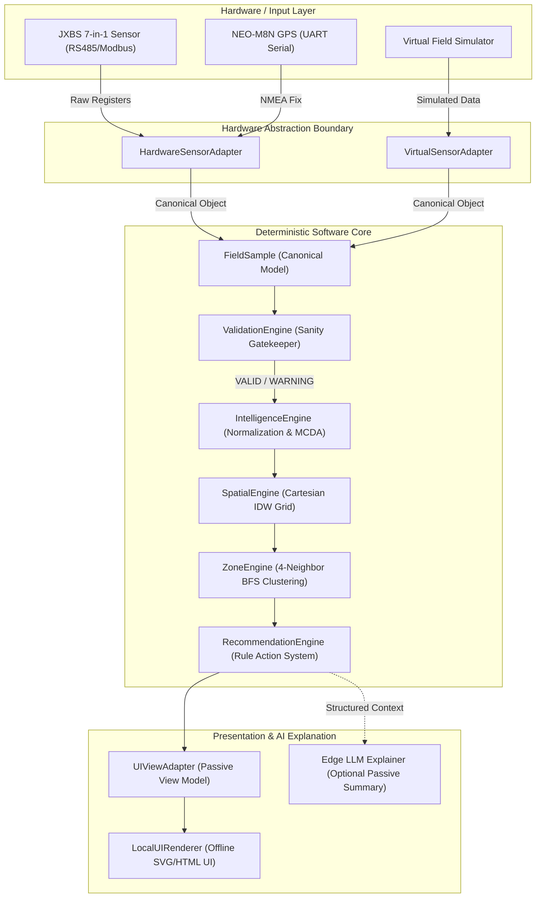
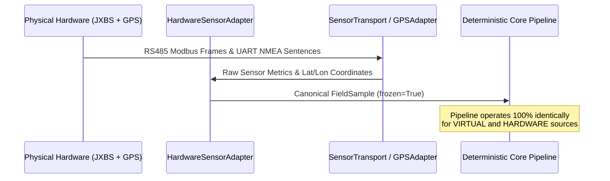
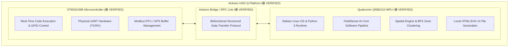

# FieldSense AI — System Architecture Specification

**STATUS:** DRAFT  
**VERSION:** 0.1  
**LAST UPDATED:** 2026-08-22  
**ARCHITECTURE STATUS:** FROZEN (`PHASE_1_RELEASE_READY`)  

---

## 1. Overall System Architecture

FieldSense AI is designed around a strictly decoupled, 8-stage canonical processing pipeline. The architecture enforces hardware independence, deterministic calculation, passive presentation, and total offline sovereignty.



---

## 2. Hardware / Software Boundary

The system isolates hardware transport protocols inside `fieldsense/hardware/`. Neither the downstream validation, scoring, spatial, zone, recommendation, nor UI modules contain hardware-specific logic.



---

## 3. Data Flow

Data flows strictly in one direction from acquisition to visualization:

```text
JXBS Sensor (RS485) ──┐
                      ├──> HardwareSensorAdapter ──┐
NEO-M8N GPS (UART) ───┘                            │
                                                   ├──> FieldSample (Immutable)
Virtual Simulator ───────> VirtualSensorAdapter ──┘
                                │
                                ▼
                         ValidationEngine
                        /                \
               [REJECTED]                [VALID / WARNING]
                   │                             │
            Audit Log Only                       ▼
                                        IntelligenceEngine
                                       (Normalization/MCDA)
                                                 │
                                                 ▼
                                           SpatialEngine
                                        (Cartesian Meter IDW)
                                                 │
                                                 ▼
                                            ZoneEngine
                                      (4-Neighbor BFS Clustering)
                                                 │
                                                 ▼
                                        RecommendationEngine
                                         (Traceable Rules)
                                                 │
                                                 ▼
                                           UIViewAdapter
                                                 │
                                                 ▼
                                          LocalUIRenderer
                                       (Standalone Offline SVG/HTML)
```

---

## 4. Arduino UNO Q Dual-Core Architecture

The target hardware platform is the **Arduino UNO Q**, featuring a dual-processor architecture with an internal high-speed IPC bridge:

```text
                     Arduino UNO Q
              ┌──────────────────────┐
              │                      │
              │ STM32U585 MCU        │
              │ Hardware peripherals │
              │ UART / GPIO          │
              │        │             │
              │        ▼             │
              │ Arduino Bridge/RPC   │
              │        │             │
              │        ▼             │
              │ QRB2210 Linux        │
              │ Python / FieldSense  │
              │                      │
              └──────────────────────┘
```



### Verified Platform Capabilities (`🟢 VERIFIED`)
- **Power & Boot**: Clean boot, stable Linux OS execution (`🟢 VERIFIED`).
- **STM32U585 MCU**: Code execution, GPIO pin control, physical UART hardware (`🟢 VERIFIED`).
- **Qualcomm QRB2210 Linux**: Python runtime execution, continuous data processing loops (`🟢 VERIFIED`).
- **Arduino Bridge / RPC**: Bidirectional structured data flow between STM32 MCU and Linux/Python (`🟢 VERIFIED`).
- **Physical UART**: Real physical voltage-level UART TX/RX signal activity verified on board (`🟢 VERIFIED`).

### Peripheral Integration Status (`🟡 PENDING V1 INTEGRATION`)
- **NEO-M8N GPS → UNO Q Integration**: `🟡 PENDING V1 INTEGRATION`
- **JXBS Soil Sensor → MAX485 → UNO Q Integration**: `🟡 PENDING V1 INTEGRATION`
- **ST7789 + XPT2046 TFT → UNO Q Integration**: `🟡 PENDING V1 INTEGRATION`
- **End-to-End FieldSample Hardware Pipeline**: `🟡 PENDING V1 INTEGRATION`

### STM32U585 MCU Responsibilities
- Real-time peripheral timing management.
- RS485 DE/RE transceiver direction switching.
- Modbus RTU polling frame transmission and CRC verification.
- UART serial ring buffer management for NEO-M8N NMEA sentences.

### Qualcomm QRB2210 MPU Responsibilities
- Executes Python standard library runtime.
- Runs the 8-stage deterministic FieldSense pipeline.
- Performs Cartesian spatial projection and IDW raster interpolation.
- Executes 4-neighbor BFS graph component clustering.
- Generates single-file self-contained HTML/CSS/SVG dashboard artifacts.

---

## 5. Arduino Bridge / RPC & Sensor -> FieldSample Flow

*(Hardware Status: Arduino UNO Q Platform, JXBS 7-in-1 Soil Sensor, NEO-M8N GPS Breakout, MAX485 RS485 Interface, & 2.8" ST7789 + XPT2046 Display = `VERIFIED AS INDIVIDUAL COMPONENTS`; System Peripheral Wiring & End-to-End Pipeline = `🟡 PENDING V1 INTEGRATION`)*

The communication link between the physical sensors, STM32 real-time MCU, and QRB2210 Linux MPU uses the verified MAX485 physical layer transceiver and the verified Arduino Bridge / RPC Inter-Process Communication (IPC) link:

```text
[ JXBS Sensor ] ──(RS485 A/B)──> [ MAX485 Transceiver ] ──(TTL UART)──> [ STM32 MCU ] ──(Bridge/RPC 🟢)──> [ QRB2210 Linux ]
                                                                                                                   │
                                                                                                                   ▼
                                                                                                         HardwareSensorAdapter
                                                                                                                   │
                                                                                                                   ▼
                                                                                                         FieldSample Instance
```

> [!NOTE]
> All core hardware components—the Arduino UNO Q platform, MAX485 RS485 transceiver module, NEO-M8N GPS module, JXBS 7-in-1 soil probe, and 2.8" ST7789 + XPT2046 Display—are now **VERIFIED** at the component level. The project is now entering V1 system integration, where the verified components will be connected and validated as a complete end-to-end system.

1. **Physical Acquisition**: MAX485 converts RS485 differential signals from JXBS probe to TTL UART for STM32 MCU. STM32 issues Modbus RTU read holding registers request (`0x0000–0x0020`).
2. **Buffer & Validate CRC**: STM32 checks frame CRC and caches raw 16-bit integer registers.
3. **IPC Transfer**: STM32 passes raw metrics and GPS sentences over verified Arduino Bridge / RPC to QRB2210 Linux `/dev` node.
4. **Adapter Conversion**: `HardwareSensorAdapter` running on QRB2210 converts raw register values and NMEA coordinates into a canonical `FieldSample` object tagged `source = SampleSource.HARDWARE`.

---

## 6. Software Pipeline & Major Interfaces

The software is structured into 11 strictly decoupled Python modules:

| Module Path | Responsibility | Primary Interface / Class |
| :--- | :--- | :--- |
| `fieldsense/domain/` | Core data contracts & enums | `FieldSample`, `FieldSession`, `SampleSource`, `ValidationState` |
| `fieldsense/input/` | Virtual field simulation | `SensorAdapter`, `VirtualSensorAdapter`, `VirtualFieldGenerator` |
| `fieldsense/hardware/` | Physical hardware integration | `HardwareSensorAdapter`, `SensorTransport`, `GPSAdapter` |
| `fieldsense/intelligence/validation/` | Physical sanity gatekeeper | `ValidationEngine`, `ValidationResult` |
| `fieldsense/intelligence/normalization/`| Piecewise metric scoring | `SampleNormalizer` |
| `fieldsense/intelligence/scoring/` | MCDA Soil Health & Carbon proxy | `IntelligenceEngine`, `ScoringEngine`, `FieldIntelligenceResult` |
| `fieldsense/spatial/` | Local Cartesian IDW raster | `SpatialEngine`, `IDWInterpolator`, `SpatialGrid` |
| `fieldsense/zones/` | 4-neighbor BFS zone clustering | `ZoneEngine`, `Zone`, `ZoneDetectionResult` |
| `fieldsense/recommendations/` | Rule-based action engine | `RecommendationEngine`, `RecommendationRule` |
| `fieldsense/presentation/` | Passive view model & HTML/SVG renderer | `UIViewAdapter`, `UIFieldView`, `LocalUIRenderer` |
| `fieldsense/storage/` | Data serialization | `to_dict()`, `from_dict()` helper protocols |

### Dependency Hierarchy & Module Direction
Dependencies enforce a strict unidirectional flow:

$$\text{Hardware / Input} \longrightarrow \text{Domain} \longrightarrow \text{Validation / Scoring} \longrightarrow \text{Spatial} \longrightarrow \text{Zones} \longrightarrow \text{Recommendations} \longrightarrow \text{Presentation}$$

#### Forbidden Dependency Violations (Architectural Defects)
- $\text{Presentation} \longrightarrow \text{Intelligence Scoring}$ (UI must never compute scores)
- $\text{Hardware} \longrightarrow \text{Recommendations}$ (Hardware must not access agronomic rules)
- $\text{Spatial} \longrightarrow \text{Presentation}$ (Spatial engine must remain UI-agnostic)
- $\text{Domain} \longrightarrow \text{External Libraries}$ (Domain models must remain pure Python)
- $\text{LLM / AI} \longrightarrow \text{Deterministic Core}$ (AI must never compute scores or zones)

---

## 7. Offline Architecture & Sovereignty

FieldSense AI is designed for 100% network-isolated execution:

```text
┌─────────────────────────────────────────────────────────────┐
│                    OFFLINE EDGE CONTAINER                   │
│                                                             │
│  [ Local Dataclasses ] ──> [ Native Math Calculations ]     │
│                                     │                       │
│                                     ▼                       │
│                       [ SVG String Vector Engine ]          │
│                                     │                       │
│                                     ▼                       │
│                        [ Local Single-File HTML ]           │
└─────────────────────────────────────────────────────────────┘
```

- **Zero Cloud APIs**: No HTTP/HTTPS calls during runtime execution.
- **Native Vector Engine**: Visual heatmaps and grid tiles are rendered as inline SVG strings generated by Python string builders.
- **Zero Web CDNs**: CSS flexbox layouts and inline SVG elements are self-contained inside `LocalUIRenderer`.

---

## 8. Decoupled AI Explanation Boundary

The future AI Explanation Layer exists strictly downstream as an optional, passive summary consumer:

```text
┌───────────────────────────┐
│ Deterministic Processing  │
│      Results Package      │
└─────────────┬─────────────┘
              │ Structured JSON Context
              ▼
┌───────────────────────────┐
│    Edge LLM Explainer     │
│ (llama.cpp / ONNX local)  │
└─────────────┬─────────────┘
              │
              ▼
┌───────────────────────────┐
│ Farmer Natural Language   │
│   Summary & Voice Guidance│
└───────────────────────────┘
```

### Strict AI Safety Rules
1. The AI module consumes `FieldIntelligenceResult`, `ZoneDetectionResult`, and `RecommendationResult` as read-only context.
2. The AI module **NEVER** computes, modifies, or overrides soil scores or management zone boundaries.
3. The AI module **NEVER** outputs quantitative chemical, fertilizer, or water prescription amounts.

---

## 9. Future Architectural Extensions

1. **SQLite Session Persistence Layer**: Replace JSON file dumps with an embedded SQLite database for historical session storage and multi-temporal trend analysis.
2. **On-Device LCD Framebuffer Driver**: Extend `fieldsense/presentation/` to render direct framebuffer graphics on 7-inch LCD touchscreens attached to the Arduino UNO Q platform.
3. **Local Quantized LLM Explainer**: Package `llama-cpp-python` with Phi-3 or Llama-3-8B quantized GGUF models for offline voice and conversational Q&A on the Qualcomm QRB2210 MPU.
